# GradeBook - School Management System

Modern school management platform built with Symfony 7.2 for managing students, teachers, grades, homework, and schedules.

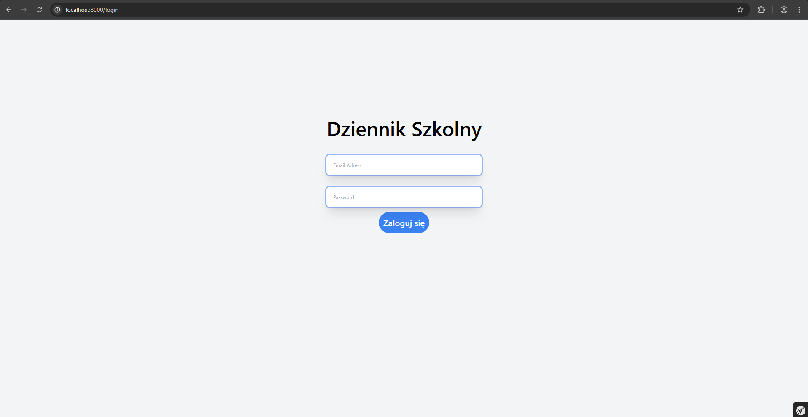

## Overview

Full-featured educational management system supporting multiple user roles with secure authentication and responsive design.

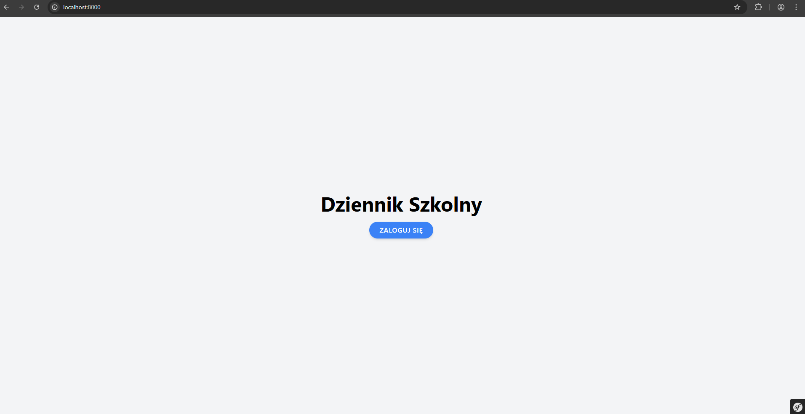

## Features

- Multi-role user management (Students, Teachers, Parents, Administrators)
- Comprehensive grade management system
- Homework assignment tracking
- Schedule management
- Parent portal for academic monitoring
- Role-based access control
- Internationalization (Polish/English)
- Responsive design

## Technology Stack

**Backend:** PHP 8.3, Symfony 7.2, Doctrine ORM, MariaDB, RabbitMQ, EasyAdmin
**Frontend:** Twig, Tailwind CSS, Stimulus/Turbo, Chart.js, Webpack Encore
**Quality:** PHPStan, PHP CS Fixer, PHPUnit, Doctrine Fixtures
**Infrastructure:** Docker, Nginx, Composer

## Architecture

Clean layered architecture following Domain-Driven Design principles:

```
src/
├── Controller/          # HTTP request handling
├── Entity/             # Database entities
├── Service/            # Business logic
├── Repository/         # Data access layer
├── DTO/                # Data Transfer Objects
├── Response/           # Custom response classes
├── Validator/          # Custom validation
├── EventSubscriber/    # Event-driven architecture
└── Factory/            # Object creation
```

## Screenshots

### Grade Management
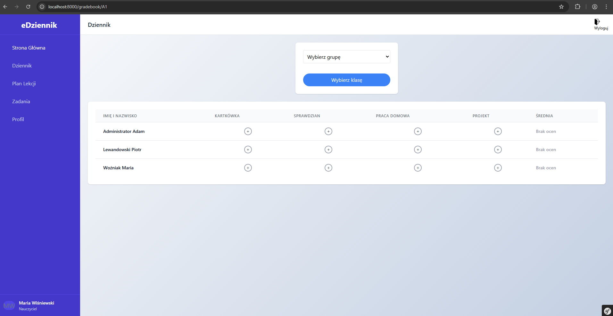

### Homework Management
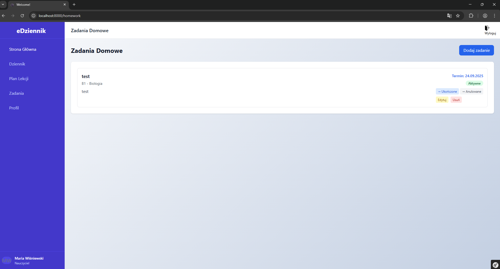
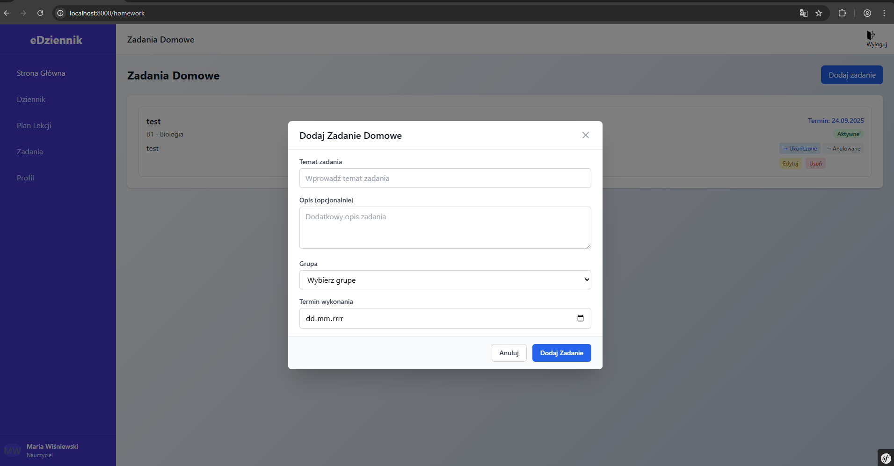

### Schedule Management
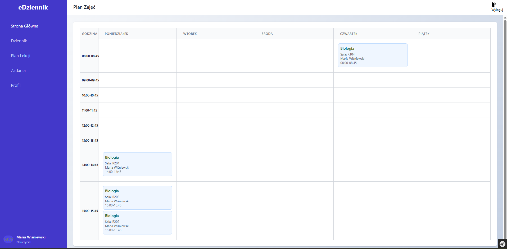
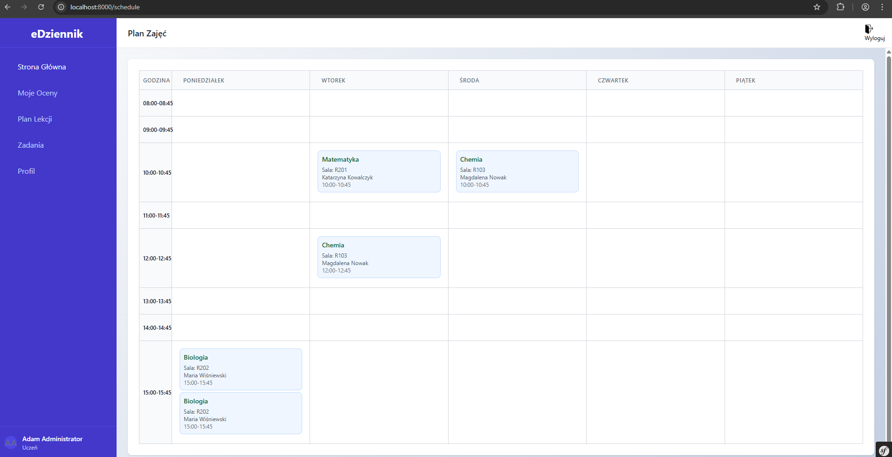

### Student Portal
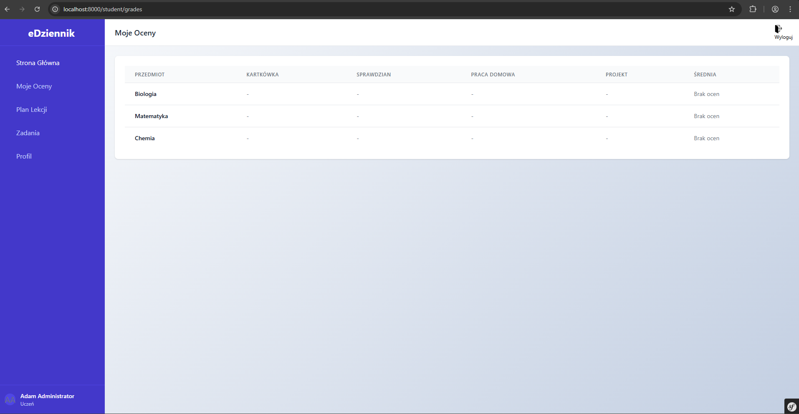

### User Management
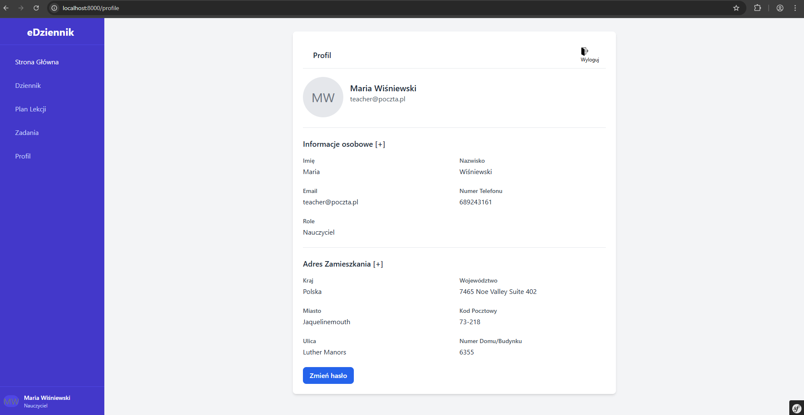
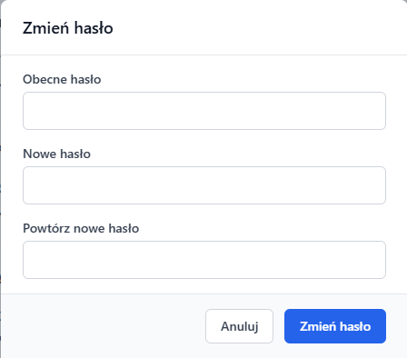

### Administrative Panel
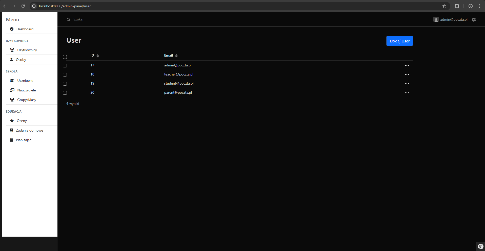
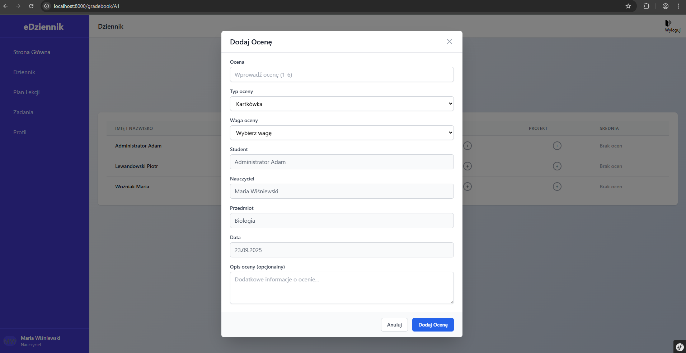

## Installation

### Prerequisites
- Docker & Docker Compose
- Git

### Quick Start

1. **Clone repository**
   ```bash
   git clone <repository-url>
   cd GradeBook-SYMFONY
   ```

2. **Start application**
   ```bash
   make start
   ```

3. **Setup database**
   ```bash
   make sf c="doctrine:migrations:migrate"
   make sf c="doctrine:fixtures:load"
   ```

4. **Build assets**
   ```bash
   docker exec gradebook-app npm install && npm run build
   ```

### Access Points
- Application: http://localhost:8000
- Admin panel: http://localhost:8000/admin
- RabbitMQ: http://localhost:15672

### Available Commands
- `make help` - Show all available commands
- `make start` - Build and start containers
- `make down` - Stop containers
- `make test` - Run tests
- `make sf c="command"` - Run Symfony commands

## Core Functionality

### User Roles
- **Students:** Grade viewing, homework tracking, schedule access
- **Teachers:** Grade management, homework creation, class oversight
- **Parents:** Child progress monitoring, academic notifications
- **Administrators:** System management, user administration

### Security
- Role-based access control (RBAC)
- CSRF protection
- Secure password hashing
- Input validation and sanitization
- Open redirect protection

## Quality Assurance

**Testing:** PHPUnit, PHPStan static analysis, PHP CS Fixer
**Commands:**
```bash
make test
make sf c="phpstan:analyse"
```

## Database Schema

Core entities: Users, Students, Teachers, Parents, Groups, Grades, Homework, Schedules

## Features

- Multi-language support (Polish/English)
- Event-driven notifications
- Optimized database queries
- Asset optimization with Webpack Encore
- Containerized deployment

## License

Proprietary software for educational institutions.
